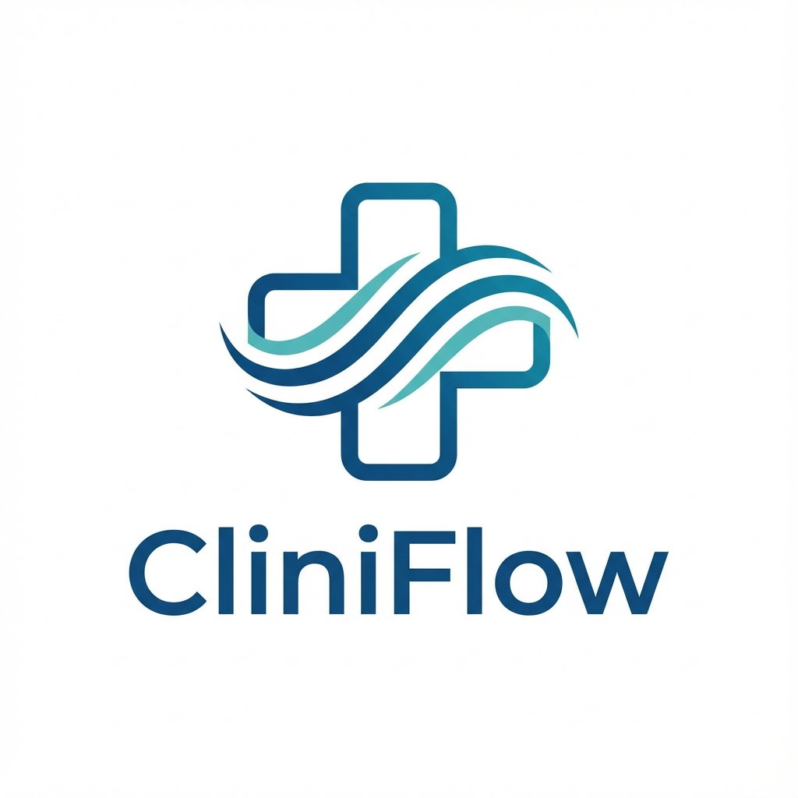

# CliniFlow - Sistema de Gestión Médica



## 🏥 Descripción

**CliniFlow** es un sistema integral de gestión para consultorios médicos que combina tecnología de vanguardia con una interfaz profesional y moderna. Diseñado para optimizar la atención médica mediante la digitalización de procesos clínicos y administrativos.

## ✨ Características Principales

### Para Pacientes
- 📅 **Agendamiento de Citas**: Sistema intuitivo para agendar consultas médicas
- 📋 **Historial Médico Digital**: Acceso completo a tu historial clínico
- 💊 **Recetas Electrónicas**: Visualiza y descarga tus recetas médicas
- 🔬 **Resultados de Laboratorio**: Consulta tus análisis clínicos
- 📱 **Acceso Multiplataforma**: Disponible en web, tablet y móvil

### Para Doctores
- 👥 **Gestión de Pacientes**: Administra tu cartera de pacientes
- 📊 **Dashboard Personalizado**: Visualiza métricas y estadísticas
- 📝 **Historiales Clínicos**: Crea y actualiza expedientes médicos
- 💉 **Prescripciones Digitales**: Genera recetas electrónicas
- 📈 **Reportes y Analytics**: Analiza tu práctica médica

### Para Administradores
- 🔐 **Gestión de Usuarios**: Control total de roles y permisos
- 📊 **Reportes Avanzados**: Analytics del sistema completo
- ⚙️ **Configuración del Sistema**: Personalización de parámetros
- 💰 **Gestión Financiera**: Control de pagos y facturación

## 🎨 Identidad de Marca

### Colores
- **Primario**: `#2C5F7C` - Azul médico profundo (confianza y profesionalismo)
- **Secundario**: `#4A9B8E` - Verde azulado medicinal (salud y bienestar)
- **Acento**: `#E67E50` - Coral cálido (humanidad y calidez)

### Tipografía
- **Fuente Principal**: Inter (Google Fonts)
- **Peso**: 300, 400, 500, 600, 700, 800

## 🛠️ Stack Tecnológico

### Frontend
- **Framework**: Next.js 15+ (App Router)
- **Lenguaje**: TypeScript 5+
- **Estilos**: CSS Modules + Tailwind CSS
- **Fuentes**: Google Fonts (Inter)

### Backend & Base de Datos
- **Autenticación**: Supabase Auth
- **Base de Datos**: Supabase (PostgreSQL)
- **Storage**: Supabase Storage
- **API**: Next.js API Routes

### Herramientas de Desarrollo
- **Linting**: ESLint
- **Type Checking**: TypeScript
- **Package Manager**: npm

## 📁 Estructura del Proyecto

```
cliniflow/
├── app/                      # Next.js App Router
│   ├── (auth)/              # Rutas de autenticación
│   │   ├── login/
│   │   ├── register/
│   │   └── forgot-password/
│   ├── (dashboard)/         # Rutas protegidas
│   │   ├── patient/
│   │   ├── doctor/
│   │   └── admin/
│   ├── appointments/        # Gestión de citas
│   ├── profile/            # Perfil de usuario
│   ├── globals.css         # Estilos globales
│   ├── layout.tsx          # Layout principal
│   └── page.tsx            # Landing page
├── lib/                    # Utilidades y configuración
│   ├── supabase.ts        # Cliente de Supabase
│   └── utils.ts           # Funciones auxiliares
├── components/            # Componentes reutilizables
│   ├── ui/               # Componentes UI
│   ├── forms/            # Formularios
│   └── navigation/       # Navegación
├── supabase/             # Configuración de Supabase
│   └── schema.sql        # Esquema de base de datos
├── public/               # Archivos estáticos
│   └── logo.png         # Logo de CliniFlow
└── package.json         # Dependencias
```

## 🚀 Instalación y Configuración

### Prerrequisitos
- Node.js 18+ instalado
- Cuenta de Supabase (gratuita)
- npm o yarn

### Paso 1: Clonar el repositorio
```bash
git clone <repository-url>
cd cliniflow
```

### Paso 2: Instalar dependencias
```bash
npm install
```

### Paso 3: Configurar variables de entorno
Crea un archivo `.env.local` en la raíz del proyecto:

```env
NEXT_PUBLIC_SUPABASE_URL=tu_url_de_supabase
NEXT_PUBLIC_SUPABASE_ANON_KEY=tu_clave_anonima_de_supabase
```

### Paso 4: Configurar Supabase
1. Crea un proyecto en [Supabase](https://supabase.com)
2. Ejecuta el script SQL en `supabase/schema.sql` en el SQL Editor de Supabase
3. Copia las credenciales (URL y Anon Key) al archivo `.env.local`

### Paso 5: Iniciar el servidor de desarrollo
```bash
npm run dev
```

La aplicación estará disponible en `http://localhost:3000`

## 📊 Base de Datos

### Tablas Principales
- **usuarios**: Información de usuarios
- **doctores**: Datos específicos de doctores
- **pacientes**: Datos específicos de pacientes
- **citas**: Citas médicas
- **historiales_medicos**: Historiales médicos
- **recetas**: Recetas médicas
- **resultados_laboratorio**: Resultados de laboratorio
- **servicios**: Servicios ofrecidos

### Seguridad
- Row Level Security (RLS) habilitado en todas las tablas
- Políticas de acceso basadas en roles
- Autenticación JWT con Supabase Auth

## 🎯 Roadmap

### Fase 1: Fundación ✅
- [x] Configuración del proyecto
- [x] Sistema de diseño
- [x] Landing page profesional
- [x] Configuración de Supabase
- [x] Esquema de base de datos

### Fase 2: Autenticación (En Progreso)
- [ ] Sistema de login
- [ ] Sistema de registro
- [ ] Recuperación de contraseña
- [ ] Verificación de email
- [ ] OAuth con Google

### Fase 3: Dashboards
- [ ] Dashboard de paciente
- [ ] Dashboard de doctor
- [ ] Dashboard de administrador

### Fase 4: Funcionalidades Core
- [ ] Sistema de agendamiento
- [ ] Gestión de citas
- [ ] Historiales médicos
- [ ] Recetas digitales

### Fase 5: Características Avanzadas
- [ ] Sistema de notificaciones
- [ ] Telemedicina
- [ ] Reportes y analytics
- [ ] Pasarela de pagos

## 👥 Equipo

Este proyecto fue desarrollado como parte de un sistema integral de gestión médica.

## 📄 Licencia

Copyright © 2024 CliniFlow. Todos los derechos reservados.

## 🤝 Contribuciones

Las contribuciones son bienvenidas. Por favor, abre un issue primero para discutir los cambios que te gustaría realizar.

## 📞 Soporte

Para soporte técnico o consultas:
- Email: info@cliniflow.com
- Teléfono: +51 1 234 5678

---

**CliniFlow** - Tu salud, nuestra prioridad 🏥
